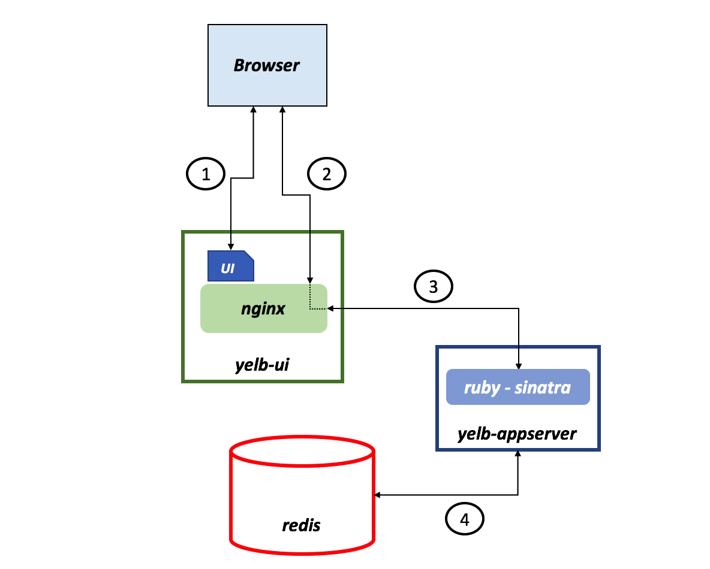
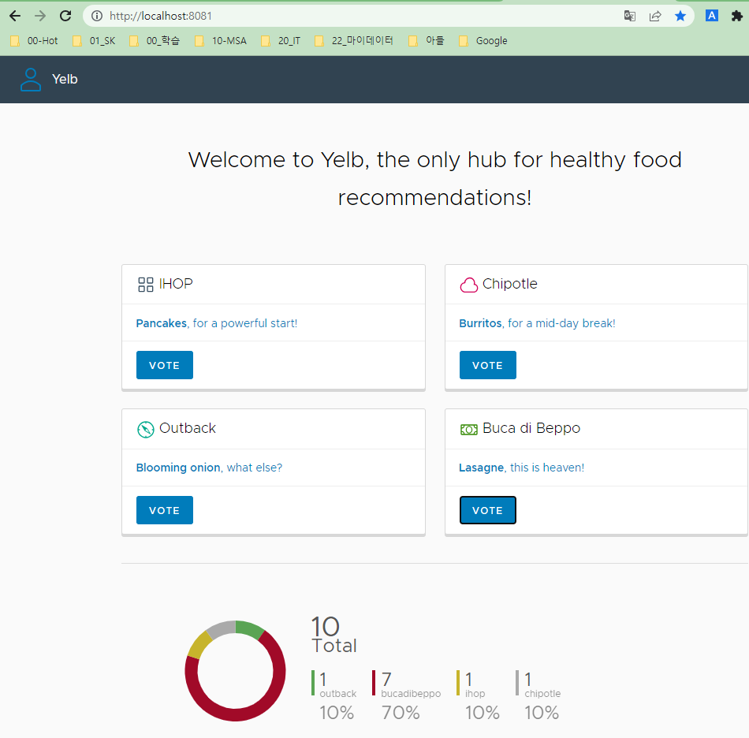
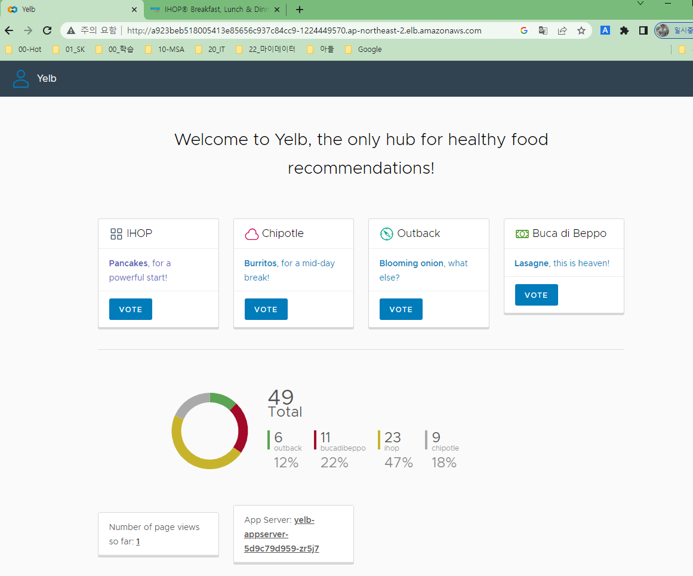

<style>
.burk {
    background-color: red;
    color: yellow;
    display:inline-block;
}
</style>

# Demo Application

원본: https://williamlam.com/2020/06/interesting-kubernetes-application-demos.html
- Yelb is a famous VMware demo application
- UI Frontend, Application Server, Database Server and Caching Service using Redis.
- GitHub: https://github.com/mreferre/yelb

3가지 Case로 확인
1. 로컬 Docker 환경에서 실행
2. 기 구축된 쿠베네티스가 있다고 가정하고 실행
3. terraform 코드로 쿠베네티스 클러스터부터 생성하기


어플리케이션 특징
- UI-> Angular 2 애플리케이션
- 응용 프로그램 구성 요소는 yelb-appserver. redis-server이것은 기본적으로 캐시 서버( )와 Postgres 백엔드 데이터베이스( yelb-db) 를 읽고 쓰는 Sinatra 애플리케이션
- 사용자가 일련의 대안(레스토랑)에 투표하고 받은 투표 수에 따라 원형 차트를 동적으로 업데이트할 수 있습니다.

아키텍처



관련 도커 이미지

```console
docker pull mreferre/yelb-ui:0.10
docker pull mreferre/yelb-appserver:0.7
docker pull mreferre/yelb-db:0.6
```

## 1. Local에서 Docker로 실행

실행 이미지는 docker hub의 이미지로 실행함
```console
$ cd /d/@EDU/cloud-lv3-2023/cloud-docs/AWS가이드따라하기/yelb-master/deployments/localtest 
$ docker-compose up
```

docker-compose.yaml
```yaml
#use this with `docker-compose up` against a generic Docker end-point (e.g. standalone Docker)
version: "2.1"
services:
  yelb-ui:
    image: mreferre/yelb-ui:0.10
    depends_on:
      - yelb-appserver
    ports:
      - 8081:80
    environment:
      - UI_ENV=test # dev | test | prod 

  yelb-appserver:
    image: mreferre/yelb-appserver:0.7
    depends_on:
      - redis-server
      - yelb-db
    ports:
      - 4567:4567
    environment:
      - RACK_ENV=test # development | test | production 

  redis-server:
    image: redis:4.0.2
    ports:
      - 6379:6379

  yelb-db:
    image: mreferre/yelb-db:0.6
    ports:
      - 5432:5432
```

로컬 실행 결과
- 


## 2.기 구축된 쿠베네티스가 있다고 가정하고 실행
### 2.1 쿠베네티스 환경설정
"클라우드네이티브를 위한 쿠베네티스 2장"을 참조해서 k8s cluster 구성

1. 기본 환경 설정
   ```console
   cd /d/@EDU/cloud-lv3-2023/Book_클라우드네이티브를위한쿠버네티스실전 프로젝트/download/k8s-aws-book-master/eks-env 
   ```
2. cloudFormation
   - 스택: Cloudformation으로 생성하는 리소스
   - 템플릿을 지정하여 '스택'을 생성하고나 이미 생성한 스택을 삭제하면 거기에 포함된 리소스를 한번에 삭제
   - '01_base_resources_cfn.yaml'
   - Stack name: eks-work-base
3. Cluster 생성 
   - 'vpc-public-subnets'은 2번의 output 확인

     ```console
     eksctl create cluster \
     --vpc-public-subnets    subnet-0260f84f5438d88da,subnet-08dd70d728db9f744,subnet-0ab6236f372055b43 \
     --region ap-northeast-2 \
     --version 1.23 \
     --nodegroup-name eks-work-nodegroup \
     --node-type t2.small \
     --nodes 1 \
     --nodes-min 1 \
     --nodes-max 5
     ```

### 2.2 클러스터에 Demo App 배포
LoadBalancer Service Deployment:
1. Deploy the application

   ```console
   $ kubectl create ns yelb           
   
   $ kubectl apply -f https://raw.githubusercontent.com/lamw/vmware-k8s-app-demo/master/yelb-lb.yaml
   service/redis-server created
   service/yelb-db created
   service/yelb-appserver created
   service/yelb-ui created
   deployment.apps/yelb-ui created
   deployment.apps/redis-server created
   deployment.apps/yelb-db created
   deployment.apps/yelb-appserver created
   ```

2. Verify all pods are ready

   ```console
   $ kubectl -n yelb get pods -w
   NAME                              READY   STATUS    RESTARTS   AGE
   redis-server-5c8c579489-wt4kn     1/1     Running   0          10s
   yelb-appserver-5d9c79d959-zr5j7   1/1     Running   0          10s
   yelb-db-84748b97cb-f5klx          1/1     Running   0          10s
   yelb-ui-798f4b69bf-jnczk          1/1     Running   0          10s
   ```

3. To access the application, open web browser to http://<external-ip>

   ```console
   $ kubectl -n yelb get svc/yelb-ui
   NAME      TYPE           CLUSTER-IP      EXTERNAL-IP                                                                    PORT(S)        AGE
   yelb-ui   LoadBalancer   10.100.244.76   a923beb518005413e85656c937c84cc9-1224449570.ap-northeast-2.elb.amazonaws.com   80:30604/TCP   27s
   ```
4. 실행 결과

   - 


### yaml 파일
https://raw.githubusercontent.com/lamw/vmware-k8s-app-demo/master/yelb-lb.yaml
```yaml
# Minor modification from http://www.it20.info/2017/07/yelb-yet-another-sample-app/ for demo purposes
apiVersion: v1
kind: Service
metadata:
  name: redis-server
  labels:
    app: redis-server
    tier: cache
  namespace: yelb
spec:
  type: ClusterIP
  ports:
  - port: 6379
  selector:
    app: redis-server
    tier: cache
---
apiVersion: v1
kind: Service
metadata:
  name: yelb-db
  labels:
    app: yelb-db
    tier: backenddb
  namespace: yelb
spec:
  type: ClusterIP
  ports:
  - port: 5432
  selector:
    app: yelb-db
    tier: backenddb
---
apiVersion: v1
kind: Service
metadata:
  name: yelb-appserver
  labels:
    app: yelb-appserver
    tier: middletier
  namespace: yelb
spec:
  type: ClusterIP
  ports:
  - port: 4567
  selector:
    app: yelb-appserver
    tier: middletier
---
apiVersion: v1
kind: Service
metadata:
  name: yelb-ui
  labels:
    app: yelb-ui
    tier: frontend
  namespace: yelb
spec:
  type: LoadBalancer
  ports:
  - port: 80
    protocol: TCP
    targetPort: 80
  selector:
    app: yelb-ui
    tier: frontend
---
apiVersion: apps/v1
kind: Deployment
metadata:
  name: yelb-ui
  namespace: yelb
spec:
  selector:
    matchLabels:
      app: yelb-ui
  replicas: 1
  template:
    metadata:
      labels:
        app: yelb-ui
        tier: frontend
    spec:
      containers:
      - name: yelb-ui
        image: mreferre/yelb-ui:0.6
        ports:
        - containerPort: 80
---
apiVersion: apps/v1
kind: Deployment
metadata:
  name: redis-server
  namespace: yelb
spec:
  selector:
    matchLabels:
      app: redis-server
  replicas: 1
  template:
    metadata:
      labels:
        app: redis-server
        tier: cache
    spec:
      containers:
      - name: redis-server
        image: redis:4.0.2
        ports:
        - containerPort: 6379
---
apiVersion: apps/v1
kind: Deployment
metadata:
  name: yelb-db
  namespace: yelb
spec:
  selector:
    matchLabels:
      app: yelb-db
  replicas: 1
  template:
    metadata:
      labels:
        app: yelb-db
        tier: backenddb
    spec:
      containers:
      - name: yelb-db
        image: mreferre/yelb-db:0.5
        ports:
        - containerPort: 5432
---
apiVersion: apps/v1
kind: Deployment
metadata:
  name: yelb-appserver
  namespace: yelb
spec:
  selector:
    matchLabels:
      app: yelb-appserver
  replicas: 1
  template:
    metadata:
      labels:
        app: yelb-appserver
        tier: middletier
    spec:
      containers:
      - name: yelb-appserver
        image: mreferre/yelb-appserver:0.5
        ports:
        - containerPort: 4567
```


## 3. Terraform으로 구성하기

Root Dir: /d/@EDU/cloud-lv3-2023/cloud-docs/AWS가이드따라하기/yelb-master/deployments/platformdeployment/AWS/ECS/Terraform 

1. 일단 실행해 본다
   ```console
   $ terraform init
   $ terraform plan
   $ terraform apply
   
   Outputs:
   
   alb_hostname = "yelb-load-balancer-252875827.eu-central-1.elb.amazonaws.com"
   region = "eu-central-1"
   user = "034677339045"
   
   $ terraform destroy
   
   ```

2. ECR등으로 변경하면서 실행.. 