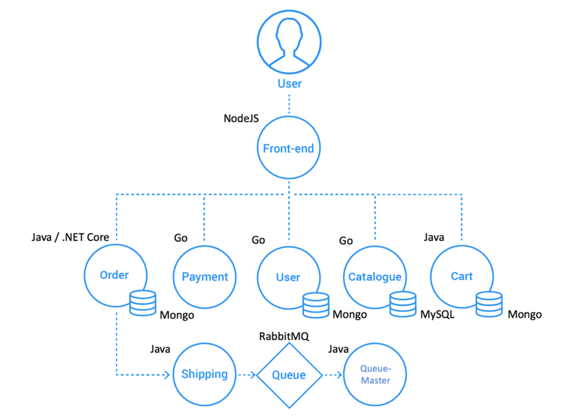
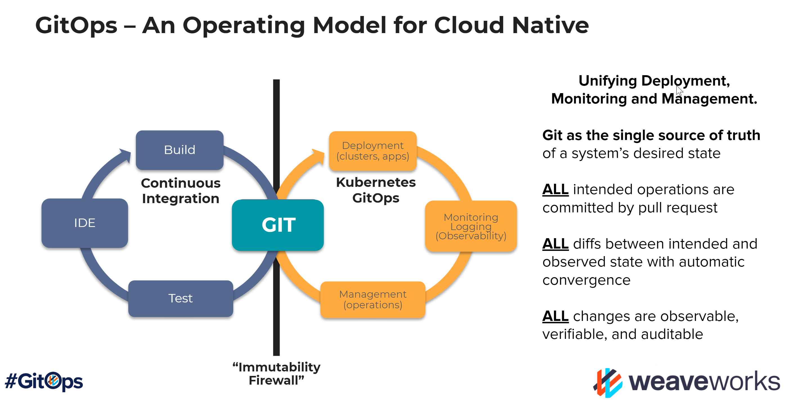

# Sock Shop

[Git URL](https://github.com/microservices-demo/microservices-demo)

- It is built using Spring Boot, Go kit and Node.js and is packaged in Docker containers.

## 어플리케이션 구조
https://weaveworks-gitops.awsworkshop.io/22_workshop_1/40_deploy_sample_app.html

