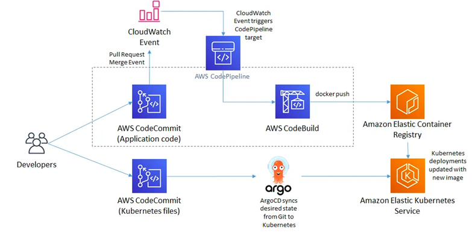

# 1차 코칭

Amazon 

## 1차 코칭 동영상

Cloud Platform Eng. 전문가 과정 1차수 코칭(AWS 1조)
- URL: https://bit.ly/46x0c0j
- PW: skcc@123

## 주요 URL

1. MSA Demo Application
   -	Sock Shop: https://github.com/microservices-demo/microservices-demo
   -	Online Boutique Shop: https://github.com/GoogleCloudPlatform/microservices-demo
   -	그 외 다양한 MSA 샘플 애플리케이션 (13종): https://gasidaseo.notion.site/MSA-13-382799b72d5d49a9a15dcafd123c1aa8

2. ArgoCD 관련 링크
   -	기본 구성 참고
   -	https://itnext.io/how-to-build-a-gitops-pipeline-on-a-stack-of-aws-services-63f7670b5f95
   -  
3. 참고글
   - Jenkins 사용 및 yaml 자동 커밋: https://may9noy.tistory.com/704
   -EKS Workshop: 
     - https://www.eksworkshop.com/docs/automation/gitops/argocd/
     -	https://catalog.workshops.aws/eks-immersionday/en-US/cicd-argocd
   -  Amazon EKS 클러스터 마이그레이션 전략 - Blue/Green, Canary 사용
      -	https://aws.amazon.com/ko/blogs/tech/blue-green-or-canary-amazon-eks-clusters-migration-for-stateless-argocd-workloads/